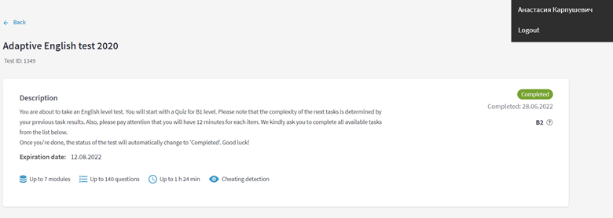

# Anastasiya Karpushevich
## Contacts:

**Phone:** +375445394631

**E-mail:** a.karpushevich.a@gmail.com

**Github:** NastyaKrp

**Telegram:** @nastya_krp

**Discord:** nastya.krpush (@NastyaKrp)

**[LinkedIn](https://www.linkedin.com/in/anastasia-karpushevich-5740b7244/)**

## About Me:

I’m a second-year student of BSU, faculty of applied math and computer science.

I have a great desire to upgrade my skills constantly, especially when it brings pleasure at the same time. 
Now I’m interested in getting more experience and knowledge in front-end. 

I’m a disciplined, ambitious and open-minded person.

## Skills:

* HTML5, CSS3
* JavaScript
* Figma, Adobe Photoshop 
* Git, GitHub

## Code example:
[DESCRIPTION:](https://www.codewars.com/kata/5264d2b162488dc400000001)

Write a function that takes in a string of one or more words, and returns the same string, but with all five or more letter words reversed (Just like the name of this Kata). Strings passed in will consist of only letters and spaces. Spaces will be included only when more than one word is present.

```
function spinWords(string)
{
  let res = '';
  let arr = new Array;
  arr = string.split(" ");
  let str = '';
  if(arr.length === 1)
    {
      str = arr[0];
      if(str.length >= 5) return str.split('').reverse().join('');
      else return str;
    }
  for(let i = 0; i < arr.length; i++)
    {
      str = arr[i]
      if(i === arr.length - 1)
        {
          if(str.length >= 5) return `${res}${str.split('').reverse().join('')}`;
          else return `${res}${str}`;
        }
      if(str.length >= 5)
        {
          res = `${res}${str.split('').reverse().join('')} `;
        }
      else
        {
          res = `${res}${str} `;
        }
    }
  return res;
}
```

## Experience:
[Example](https://nastyakrp.github.io/test/) of work during course (Itlogia Frontend Start)

## Education:
* [Html](https://ru.code-basics.com/languages/html), [Css](https://ru.code-basics.com/languages/css), [Js](https://ru.code-basics.com/languages/javascript) courses on Code Basics (completed)
* Git course EPAM (completed)
* Itlogia Frontend Start (completed)

## Languages:

* English – B2 (result of EPAM test)



* Russian – Native

* Belarusian – B1


